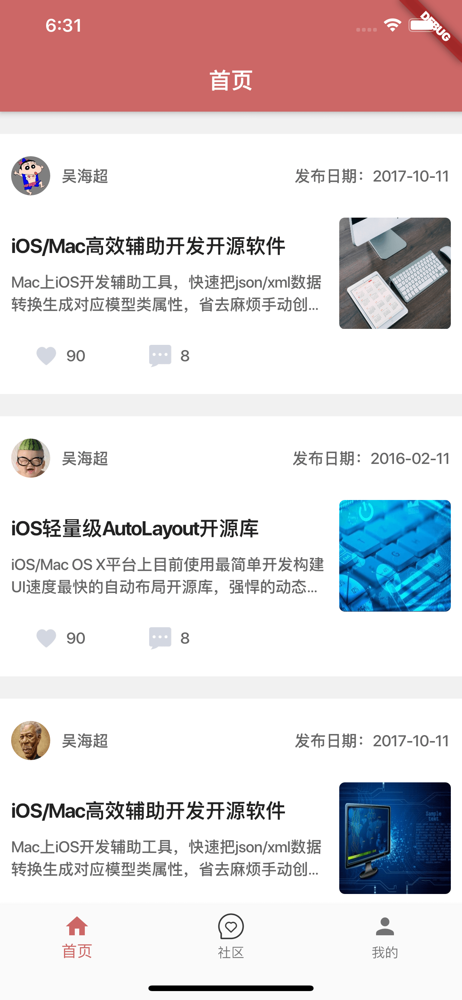
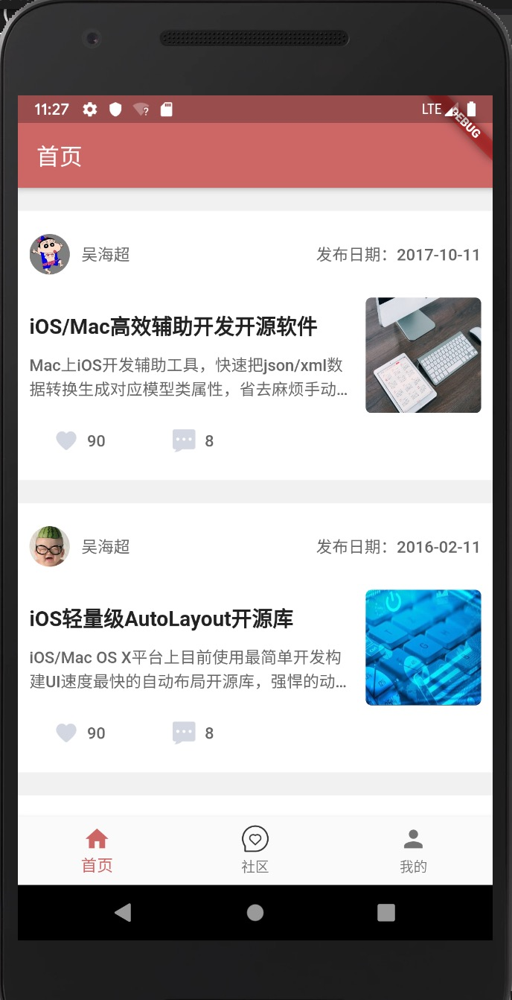
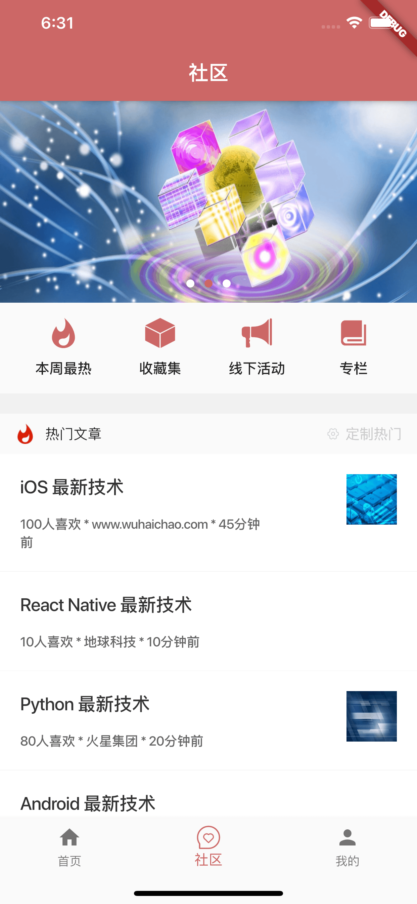
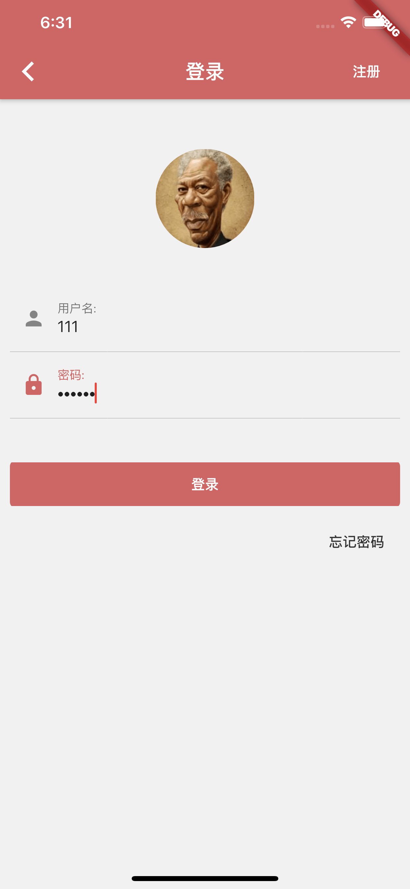
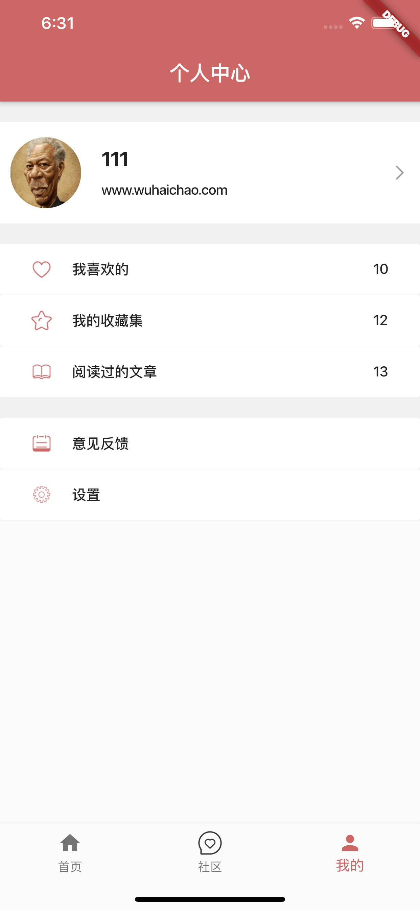
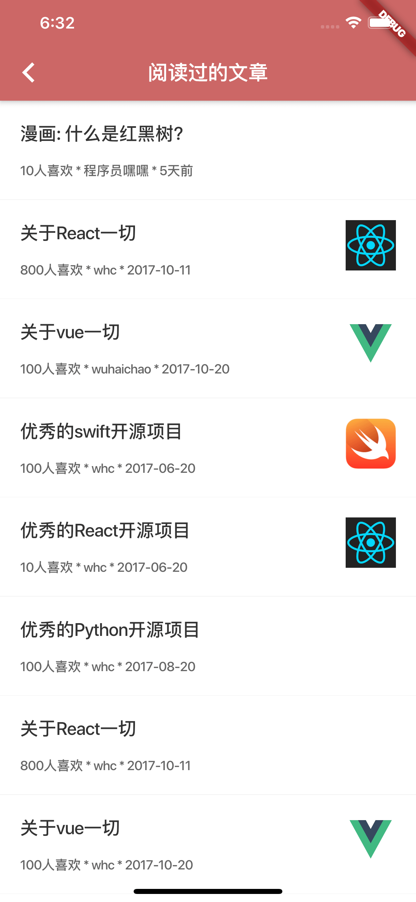

# whc_flutter_app


[](https://raw.githubusercontent.com/attentiveness/whcapp/master/LICENSE)

A complete flutter app with complete data interaction capabilities.

Provide learning advice for learning flutter development

一个完整的flutter app 并且带有完整的数据交互实现,各种常用组件的使用，封装（网络，banner，列表刷新，状态管理局部ui刷新。。。。）

**app所使用数据接口文档地址：**[http://www.wuhaichao.com/api_doc/](http://www.wuhaichao.com/api_doc/)

**个人网站：**[http://www.wuhaichao.com](http://www.wuhaichao.com)

**android版本体验下载: **[https://fir.im/jlhu](https://fir.im/jlhu)

**Support: Android 5+   iOS 8.0+**

## App Architecture

```
environment:
  sdk: ">=2.1.0 <3.0.0"

dependencies:
  flutter:
    sdk: flutter
```

### 所有包含的页面
```
routes: {
  '/': (context) => TabbarRoute(),
  'login': (context) => LoginRoute(),
  'register': (context) => RegisterRoute(),
  'forget': (context) => ForgetRoute(),
  'mylike': (context) => MyLoveRoute(),
  'didread': (context) => ReadRoute(),
  'mycollect': (context) => MyCollectRoute(),
  'feedback': (context) => FeedbackRoute(),
  'set': (context) => SetRoute(),
  'email': (context) => EmailRoute(),
  'mobile': (context) => MobileRoute(),
  'modifypsw': (context) => ModifyPswRoute(),
  'weekhot': (context) => WeekRoute(),
  'collectset': (context) => CollectSetRoute(),
  'activityoffline': (context) => ActivityOfflineRoute(),
  'column': (context) => ColumnRoute(),
  'web': (context, ) {
    var args = ModalRoute.of(context).settings.arguments as Map<String, String>;
    return WebRoute(title: args['title'], url: args['url'],);
  },
}
```

## Screenshot




## Contributing

Any good Suggestions or questions to ask or email

## License

Apache License 2.0


- [Lab: Write your first Flutter app](https://flutter.dev/docs/get-started/codelab)
- [Cookbook: Useful Flutter samples](https://flutter.dev/docs/cookbook)

For help getting started with Flutter, view our
[online documentation](https://flutter.dev/docs), which offers tutorials,
samples, guidance on mobile development, and a full API reference.
